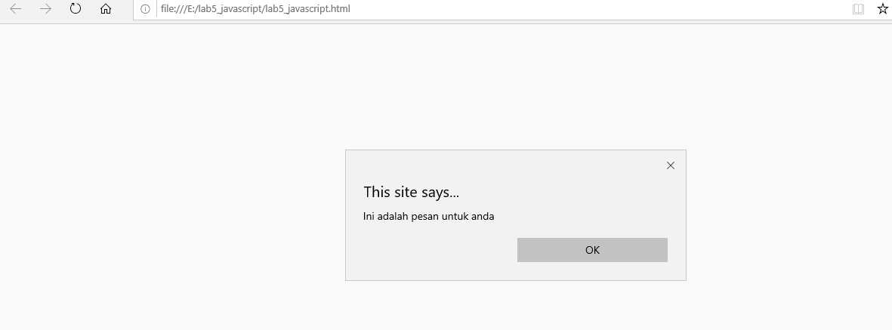

# Lab5Web

| Nama= Faris Syahluthfi      | 
|-----------------------------|
| NIM= 312010034              |
|=============================| 
| Kelas= TI.20.A.1            |
|-----------------------------|
| Matkul= Pemrograman Web     |
|=============================|

## Javascrip Dasar
Pemakaian Alert sebagai property window.

```html
<!DOCTYPE html>
<html lang="en">
<head>
<title>Mengenal JavaScript</title>
</head>
<body>
<h1>Pengenalan JavaScript</h1>
<h3>Contoh document.write dan console.log</h3>

<script language = "JavaScript">
<!--
        window.alert("Ini adalah pesan untuk anda");

        
        //-->

        document.write("Halo semuanya");
        console.log("Halo semuanya");

</script>

</body>
</html>

```
# Hasilnya codingan diatas:



