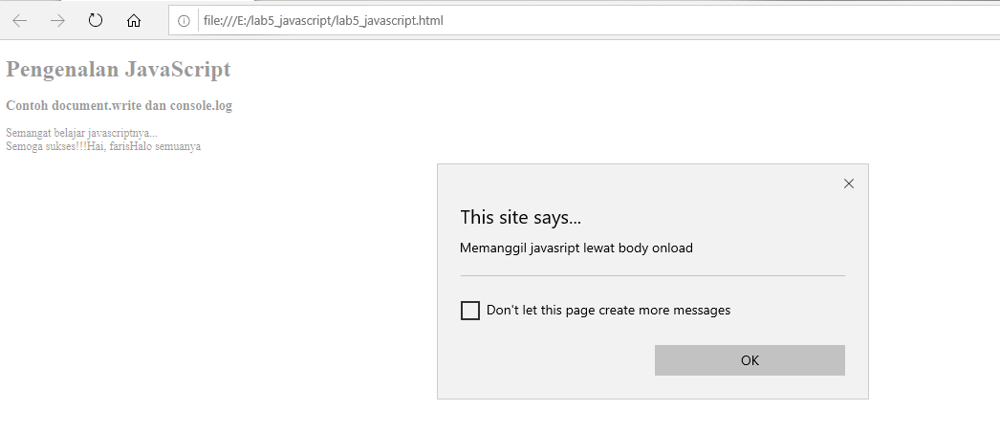

# Lab5Web

| Nama= Faris Syahluthfi      | 
|-----------------------------|
| NIM= 312010034              |
|=============================| 
| Kelas= TI.20.A.1            |
|-----------------------------|
| Matkul= Pemrograman Web     |
|=============================|

## Javascrip Dasar
Pemakaian Alert sebagai property window.

```html
<!DOCTYPE html>
<html lang="en">
<head>
<title>Mengenal JavaScript</title>
</head>
<body>
<h1>Pengenalan JavaScript</h1>
<h3>Contoh document.write dan console.log</h3>

<script language = "JavaScript">
<!--
        window.alert("Ini adalah pesan untuk anda");

        
        //-->

        document.write("Halo semuanya");
        console.log("Halo semuanya");

</script>

</body>
</html>

```
# Hasil codingan diatas:


Pemakaian method dalam objek

```html
<!DOCTYPE html>
<html lang="en">
<head>
<title>Mengenal JavaScript</title>
</head>
<body>
<h1>Pengenalan JavaScript</h1>
<h3>Contoh document.write dan console.log</h3>

<script language = "JavaScript">
<!--
        window.alert("Ini adalah pesan untuk anda");

        document.write("Semangat belajar javascriptnya...<br>");
        document.write("Semoga sukses!!!");


        //-->

        document.write("Halo semuanya");
        console.log("Halo semuanya");

</script>

</body>
</html>
```

# Hasil codingan diatas:


Pemakaian Prompt

```html
<!DOCTYPE html>
<html lang="en">
<head>
<title>Mengenal JavaScript</title>
</head>
<body>
<h1>Pengenalan JavaScript</h1>
<h3>Contoh document.write dan console.log</h3>

<script language = "JavaScript">
<!--
        window.alert("Ini adalah pesan untuk anda");

        document.write("Semangat belajar javascriptnya...<br>");
        document.write("Semoga sukses!!!");

        var nama = prompt ("Siapa nama anda?","Silhakan isi nama anda!!!");
        document.write ("Hai, " + nama);


        //-->

        document.write("Halo semuanya");
        console.log("Halo semuanya");

</script>

</body>
</html>
```

# Hasil codingan diatas:


Pembuatan fungsi dan cara pemanggilannya

```html
<!DOCTYPE html>
<html lang="en">
<head>
<title>Mengenal JavaScript</title>
<script language = "JavaScript">
    function pesan(){
        alert ("Memanggil javasript lewat body onload")
    }

</script>

</head>
<body onload=pesan()>
<h1>Pengenalan JavaScript</h1>
<h3>Contoh document.write dan console.log</h3>

<script language = "JavaScript">
<!--
        window.alert("Ini adalah pesan untuk anda");

        document.write("Semangat belajar javascriptnya...<br>");
        document.write("Semoga sukses!!!");

        var nama = prompt ("Siapa nama anda?","Silhakan isi nama anda!!!");
        document.write ("Hai, " + nama);


        //-->

        document.write("Halo semuanya");
        console.log("Halo semuanya");

</script>

</body>
</html>
```

# Hasil codingan diatas:


## Dasar Pemrograman Di Javascript
Operasi dasar aritmatika

```html
<!DOCTYPE html>
<html lang="en">
<head>
<title>Mengenal JavaScript</title>
<script language = "JavaScript">
    function pesan(){
        alert ("Memanggil javasript lewat body onload")
    }

    function test (val1,val2)
    {

        document.write("<br>" + "perkalian : val1*val2 "+" <br>")
        document.write(val1*val2)
        document.write("<br>" + "pembagian : val1/val2 "+" <br>")
        document.write(val1/val2)
        document.write("<br>" + "penjumlahan : val1+val2 "+" <br>")
        document.write(val1+val2)
        document.write("<br>" + "pengurangan : val1-val2 "+" <br>")
        document.write(val1-val2)
        document.write("<br>" + "modulus : val1%val2 "+" <br>")
        document.write(val1%val2)
    }


</script>

</head>
<body onload=pesan()>
<input type="button" name="button1" value="aritmetic" onclick=test(9,4)>

<h1>Pengenalan JavaScript</h1>
<h3>Contoh document.write dan console.log</h3>

<script language = "JavaScript">
<!--
        window.alert("Ini adalah pesan untuk anda");

        document.write("Semangat belajar javascriptnya...<br>");
        document.write("Semoga sukses!!!");

        var nama = prompt ("Siapa nama anda?","Silhakan isi nama anda!!!");
        document.write ("Hai, " + nama);


        //-->

        document.write("Halo semuanya");
        console.log("Halo semuanya");

</script>

</body>
</html>
```

# Hasil codingan diatas:


